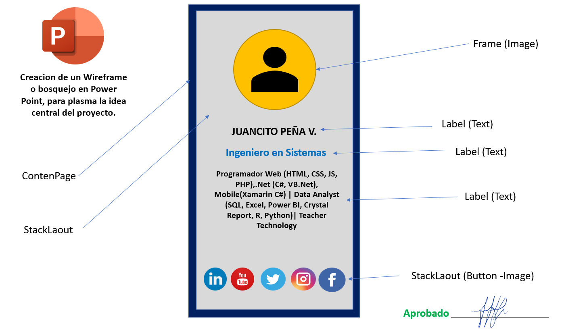
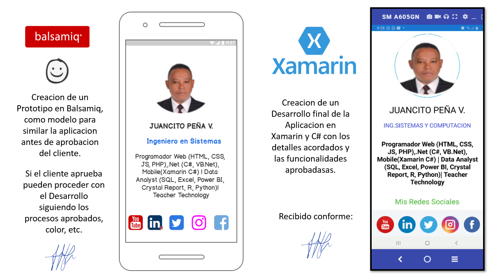

# Card_Personal_Xamarin
## Proyecto en Xamarin y C# de una App Simulacion de una Presentacion Personal, donde se hacen usos de Controles como ContentPage, StackLaout, Frame, Label, Text, Image, Button, etc, y aplicacion de conceptos de UI y UX, al aplicar la distribucion de los elementos en la pantalla, colores, y eventos acordes con lo que el usarios desearia que hiciera la aplicacion al interactuar con esos Elementos de la pantalla.

